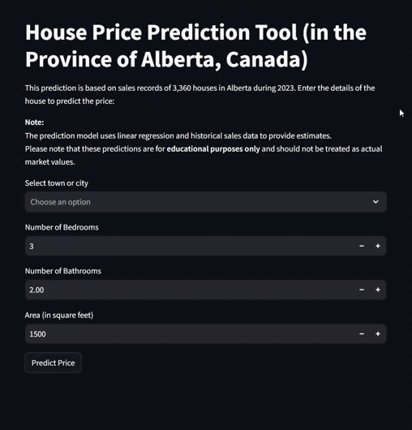

# **House Price Prediction App (Alberta, Canada) 🏡**

This project is a **web-based tool built with Streamlit** to predict house prices in Alberta, Canada. It uses **Linear Regression** to provide estimates based on several house features such as the number of bedrooms, bathrooms, square footage, and location.

---

## **Table of Contents**
1. [Overview](#overview)  
2. [Features](#features)  
3. [Technology Stack](#technology-stack)  
4. [Dataset](#dataset)  
5. [How Linear Regression Works](#how-linear-regression-works)  
6. [Installation and Setup](#installation-and-setup)  
7. [How to Run the App](#how-to-run-the-app)  
8. [Usage Instructions](#usage-instructions)  
9. [Screenshots](#screenshots)  
10. [License](#license)  
11. [Contact](#contact)  

---

# **1. Overview**

This **House Price Prediction App** predicts the price of houses in Alberta, Canada, based on real sales data from 2023. The app uses a **Linear Regression model** and allows users to enter house details such as:
- Town or city of the property.
- Number of bedrooms and bathrooms.
- Total area (in square feet).

> **Note:** This tool is for **educational purposes only** and does not reflect actual real estate market values.

---
## **2. Features**
- ✅ **User-friendly interface** using Streamlit.
- ✅ Predicts house prices based on user inputs.
- ✅ Uses **Linear Regression** for predictions.
- ✅ **Deployed with Cloudflared**, enabling easy access.

---
## **Step 4: How to Run the App**

Follow these steps to launch and run the app:

1. **Run the Streamlit app** in your terminal with the following command:

   ```bash
   streamlit run house_price_prediction.py

# **3. Technology Stack**
- **Python**: Programming language.
- **Streamlit**: Web framework for building interactive apps.
- **scikit-learn**: Machine learning library used for Linear Regression.
- **Pandas**: Data manipulation and analysis.
- **Cloudflared**: Provides temporary public URL for accessing the app.

---

# **4. Dataset**

The dataset used contains **3,360 house sales records from Alberta, Canada**, during 2023. It includes:
- **Town or city** of the house.
- **Number of bedrooms** and **bathrooms**.
- **Square footage** of the property.
- **Sale price**.

---

# **5. How Linear Regression Works**

**Linear Regression** is used to model the relationship between the features (independent variables) and the target price (dependent variable). The model assumes a **linear relationship** between the inputs (e.g., square footage) and the output (price).  

### **Steps in the Model:**
1. **One-hot encoding**: Converting categorical variables (places) into numerical values.
2. **Train-test split**: 80% of data for training, 20% for testing.
3. **Model training**: Fitting the Linear Regression model on the training data to minimize the sum of squared errors.
4. **Prediction**: Given user inputs, the model predicts house prices.

---

# **6. Installation and Setup**

## **Step 1: Clone the Repository**

```bash
git clone https://github.com/sameralas/House-Price-Prediction-App.git
cd House-Price-Prediction-App
```

---

## **Step 2: Install the Dependencies**

Install the required Python libraries using the following command:

```bash
pip install -r requirements.txt
```
---
## **Step 3: Upload the Dataset**

Make sure the **`Homes for Sale and Real Estate.xlsx`** file is in the same directory as your app.

You can upload it using the following command in a Python environment (like Google Colab):

```python
from google.colab import files
uploaded = files.upload()
```
---

Make sure the **`Homes for Sale and Real Estate.xlsx`** file is in the same directory as your app.

If you are using **Google Colab**, upload the dataset with the following code:

```python
from google.colab import files
uploaded = files.upload()
```
---
# **7: How to Run the App**

Follow these steps to launch and run the app:

1. **Run the Streamlit app** in your terminal with the following command:

   ```bash
   streamlit run house_price_prediction.py
   ```
2. **Open the app in your browser at:


   ```bash
   Open the app in your browser at:


   ```
3. **Optional: Host the app using Cloudflare Tunnel

   ```bash
   cloudflared tunnel --url http://localhost:8501
   ```
4. **Access the public URL provided by Cloudflare in your browser.
---

# **8: Usage Instructions**
Select the town or city from the dropdown list.
Enter the number of bedrooms and bathrooms.
Provide the square footage of the house.
Click the “Predict Price” button to get the predicted price.
---
# **9. Example: 



---
# **Step 10: License**

This project is licensed under the **MIT License**.

```vbnet
MIT License

Copyright (c) 2024 <Your Name>

Permission is hereby granted, free of charge, to any person obtaining a copy
of this software and associated documentation files (the "Software"), to deal
in the Software without restriction, including without limitation the rights
to use, copy, modify, merge, publish, distribute, sublicense, and/or sell
copies of the Software, and to permit persons to whom the Software is
furnished to do so, subject to the following conditions:

The above copyright notice and this permission notice shall be included in all
copies or substantial portions of the Software.

THE SOFTWARE IS PROVIDED "AS IS", WITHOUT WARRANTY OF ANY KIND, EXPRESS OR
IMPLIED, INCLUDING BUT NOT LIMITED TO THE WARRANTIES OF MERCHANTABILITY,
FITNESS FOR A PARTICULAR PURPOSE AND NONINFRINGEMENT. IN NO EVENT SHALL THE
AUTHORS OR COPYRIGHT HOLDERS BE LIABLE FOR ANY CLAIM, DAMAGES OR OTHER
LIABILITY, WHETHER IN AN ACTION OF CONTRACT, TORT OR OTHERWISE, ARISING FROM,
OUT OF OR IN CONNECTION WITH THE SOFTWARE OR THE USE OR OTHER DEALINGS IN THE
SOFTWARE.
```
---

# **Step 11: Contact**

If you have any questions or feedback, feel free to reach out:

- **GitHub**: (https://github.com/SamerAlas)  
- **Email**: (sam.sasamer@gmail.com)
